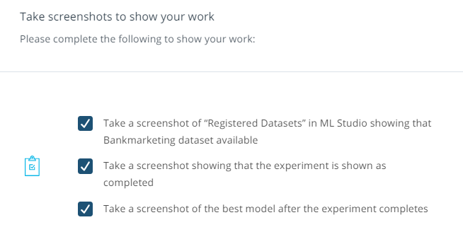
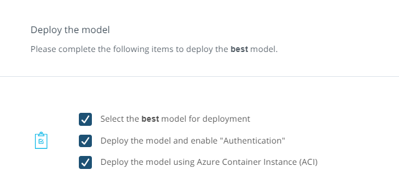
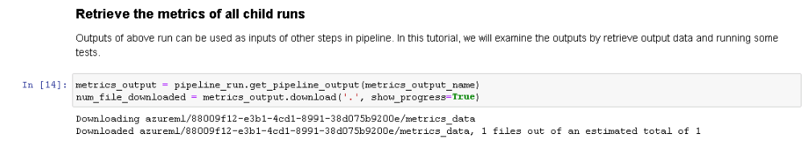
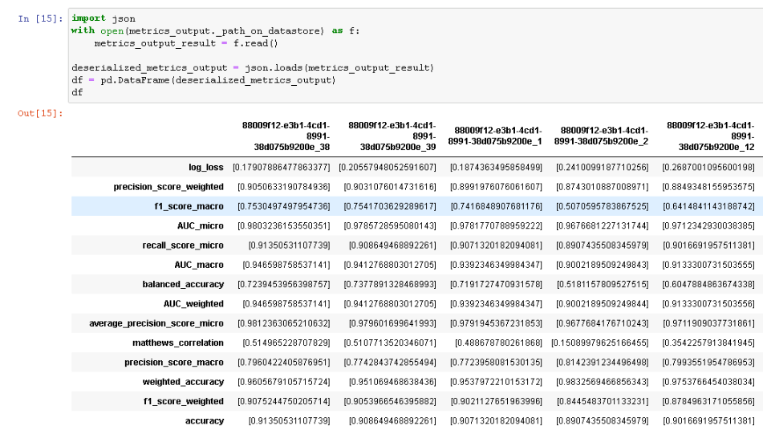
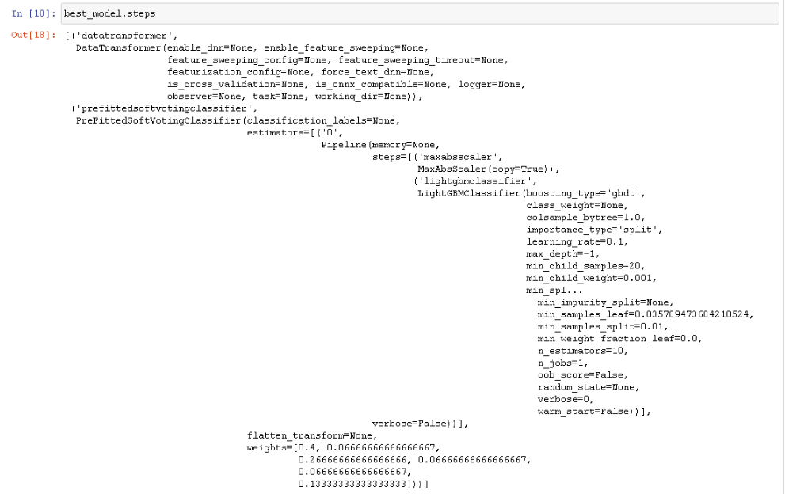
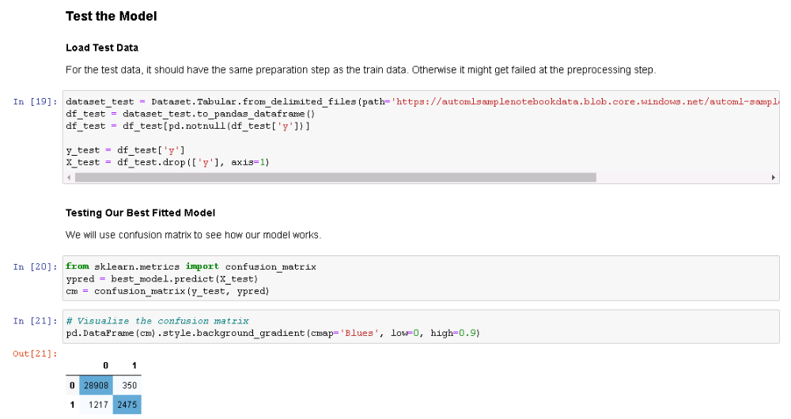

# Operationalizing Machine Learning
### **Overview**
In this project, we will continue to work with the Bank Marketing dataset. We will use Azure to configure a cloud-based machine learning production model, deploy it, and consume it. We will also create, publish, and consume a pipeline. In the end, we will demonstrate all of our work by creating a README file and a screencast video.
### **Project main steps**
In this project, we will following the below steps:
1.	Authentication
2.	Automated ML Experiment
3.	Deploy the best model
4.	Enable logging
5.	Swagger Documentation
6.	Consume model endpoints
7.	Create and publish a pipeline
8.	Documentation

# Create and run Auto ML Experiment
Dataset has been, created with the name “project2-demo”

# Deploy the Best Model
Best model is the one which, is on the top of the list and the algorithm is “Voting Ensemble”

Best model has been, deployed using “Azure Container Instance (ACI)”

# Enable Application Insights

# Swagger Documentation

# Consume Model Endpoints & Benchmarking

# Create, Publish and Consume a Pipeline

