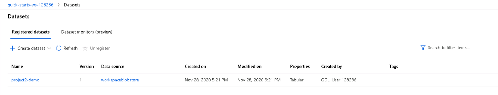

# Operationalizing Machine Learning
### **Overview**
In this project, we will continue to work with the Bank Marketing dataset. We will use Azure to configure a cloud-based machine learning production model, deploy it, and consume it. We will also create, publish, and consume a pipeline. In the end, we will demonstrate all of our work by creating a README file and a screencast video.  

The production model is being deployed to an Endpoint using “Azure Container Instance (ACI)” as the compute type

### Future Work
As part of future work, we can improvise on the below factors:
### MODEL ACCURACY IMPROVEMENT
1. Usage of Default data splits and cross-validation while performing AutoML through python SDK. In the code snippet, we notice that only the required parameters are defined, that is the parameters for n_cross_validation or validation_ data are not included. If we do not explicitly specify either a validation_data or n_cross_validation parameter, AutoML applies default techniques depending on the number of rows in the single dataset training_data provided.  
a) Provide validation data  
b) Provide validation set size  
c) Set the number of cross-validations  
Cross-validation is not enabled by default; it must be configured in automated ML settings. However, after cross-validation is configured and a validation data set has been provided, the process is automated. The idea is that a model could get "lucky" and have great accuracy with one subset, but by using many subsets the model won't achieve this high accuracy every time. 

2. Removing features can also help with over-fitting by preventing the model from having too many fields to use to memorize specific patterns, thus causing it to be more flexible. It can be difficult to measure quantitatively, but if we can remove features and retain the same accuracy, you have likely made the model more flexible and have reduced the risk of over-fitting. View featurization settings: if we choose to enable Automatic featurization in the Additional configuration settings form, default featurization techniques are applied. In the View featurization settings we can change these defaults and customize accordingly.

3. For classification, you can also enable deep learning. If deep learning is enabled, validation is limited to train_validation split.

4. In AutoML run we can use the allowed_models or blocked_models parameters to further, modify iterations with the available models to include or exclude

### MODEL INFRASTRUCTURE IMPROVEMENT

5. It is widely accepted that for deep learning training, GPUs should be used due to their significant speed when compared to CPUs. However, due to their higher cost, for tasks like inference which are not as resource heavy as training, it is usually believed that CPUs are sufficient and are more attractive due to their cost savings. However, when inference speed is a bottleneck, using GPUs provide considerable gains both from financial and time perspectives.
We can also use GPU-based compute to train deep learning models, and switching to lower-cost CPU-only compute to test and register the trained model.

## SCREENCAST LINK : 
https://youtu.be/Bu1K2PEVKNM [Duration- 6:38]  

## PART 1 - CONFIGURE CLOUD BASED ML MODEL & CONSUME THE MODEL

# Create and run Auto ML Experiment
### Dataset has been, created with the name “project2-demo” using the Bank Marketing dataset

### The Bank Marketing dataset is being reflecting under the Registered datasets tab & it has been registered as project2-demo

### Then we run the AutoML experiment & below screenshot shows the Run to be completed and the Best Model uses “Voting Ensemble” with an Accuracy of 0.91593

### Below screenshot shows the various algorithms that has been used along with their Accuracies

# Deploy the Best Model
### Best model is the one which, is on the top of the list and the algorithm is “Voting Ensemble”

### Best model has been, deployed using “Azure Container Instance (ACI)” & Authentication has also been enabled

# Enable Application Insights
### Below screenshot shows the execution summary of "logs.py" post making changes in the file 

### Below screenshot shows the Applications Insight URL

# Swagger Documentation
### Below two screenshots show that "swagger.json" file has been copied in the "swagger" directory

### Then we ensure that Docker is running and we make changes in the Port# from 80 to 9000 in the "swagger.sh" file
#### Below screenshot shows that localhost:9000 is accessible post running the "swagger.sh" file
#### After the Swagger UI container is running, we can access the website on http://localhost:9000.

#### On the top bar, where petsore.swagger.io shows, we change it to http://localhost:8000/swagger.json, then hit the Explore button. It now displays the content of the API for the model

# Consume Model Endpoints & Benchmarking
#### Then we copy the REST endpoint URL and the Primary Key from the deployed Endpoint, Consume tab and make changes in the "endpoint.py" file

#### Below screenshot shows the output post executing the "endpoint.py" file

#### A data.json file will appear after we run endpoint.py

#### In the provided started code, there is a benchmark.sh script with a call to ab which when executed display the below results

## PART 2 - CREATE, PUBLSH & CONSUME A PIPELINE

# Create, Publish and Consume a Pipeline
## Important libraries are imported and finally displays the SDK version

## Using the same configuration file we initialize the workspace

## Then we create the experiment with the same name which we have created earlier

## Then we use the existing cluster

## Then we use the existing data set which we have registered earlier & it displays the Basic Statistical Summary

## For training purpose we define the AutoML settings and call the AutoMLConfig class

## Now we create the pipeline for which we prepare the pipeline data by defining the name for the best model and location for our datastore
## Now we create the autoML step by calling the autoMLconfig

## Finally we create a pipeline by calling the autoML step

## Then we submit the pipeline

## Below screenshots display that the Run has been completed

## Finally the Pipeline execution summary is being displayed

## We then publish the pipeline and enable authentication locally
### We need the REST url which would be contained in the pipeline_endpoint object
#### HTTP post request is created using the endpoint URL, authentication header and the JSON file

## We then retrieve the Submitted pipeline run

### The “Published Pipeline overview”, showing a REST endpoint and a status of ACTIVE. It can be found under  
### Endpoints > Pipeline Endpoints

### The Bankmarketing dataset with the AutoML module. It can be found under:
### Piplelines > Bankmarketing Train

# END OF PROJECT
