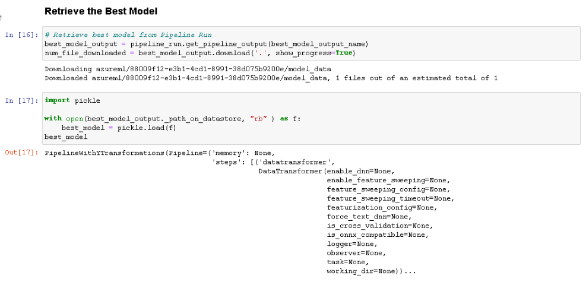

# Operationalizing Machine Learning
### **Overview**
In this project, we will continue to work with the Bank Marketing dataset. We will use Azure to configure a cloud-based machine learning production model, deploy it, and consume it. We will also create, publish, and consume a pipeline. In the end, we will demonstrate all of our work by creating a README file and a screencast video.  

## FEEDBACK- 1

The production model is being deployed to an Endpoint using “Azure Container Instance (ACI)” as the compute type
### Future Work
As part of future work, we can improvise on the below factors:
1. We could use GPU's in comparison to CPU's due to their significant speed
2. We could also use higher end of Memory Optimized CPU CLuster
3. In AutoML run We can use the allowed_models or blocked_models parameters to further, modify iterations with the available models to include or exclude
4. In AutoML while performing Classification task we could try enabling Deep Learning
5. We could also use single node AKS cluster

### **Project main steps**
In this project, we will following the below steps:
1.	Authentication
2.	Automated ML Experiment
3.	Deploy the best model
4.	Enable logging
5.	Swagger Documentation
6.	Consume model endpoints
7.	Create and publish a pipeline
8.	Documentation

## FEEDBACK- 2

## SCREENCAST LINK : https://youtu.be/xVRWRwvEzYY

## PART 1 - CONFIGURE CLOUD BASED ML MODEL & CONSUME THE MODEL

# Create and run Auto ML Experiment
### Dataset has been, created with the name “project2-demo” using the Bank Marketing dataset

### The Bank Marketing dataset is being reflecting under the Registered datasets tab

### Then we run the AutoML experiment & below screenshot shows the Run to be completed and the Best Model uses “Voting Ensemble” with an Accuracy of 0.91593

### Below screenshot shows the various algorithms that has been used along with their Accuracies

# Deploy the Best Model
### Best model is the one which, is on the top of the list and the algorithm is “Voting Ensemble”

### Best model has been, deployed using “Azure Container Instance (ACI)” & Authentication has also been enabled

# Enable Application Insights
### Below screenshot shows the execution summary of "logs.py" post making changes in the file 

### Below screenshot shows the Applications Insight URL

# Swagger Documentation
### Below two screenshots show that "swagger.json" file has been copied in the "swagger" directory

### Then we ensure that Docker is running and we make changes in the Port# from 80 to 9000 in the "swagger.sh" file
#### Below screenshot shows that localhost:9000 is accessible post running the "swagger.sh" file
#### After the Swagger UI container is running, we can access the website on http://localhost:9000.

#### On the top bar, where petsore.swagger.io shows, we change it to http://localhost:8000/swagger.json, then hit the Explore button. It now displays the content of the API for the model

# Consume Model Endpoints & Benchmarking
#### Then we copy the REST endpoint URL and the Primary Key from the deployed Endpoint, Consume tab and make changes in the "endpoint.py" file

#### Below screenshot shows the output post executing the "endpoint.py" file

#### A data.json file will appear after we run endpoint.py

#### In the provided started code, there is a benchmark.sh script with a call to ab which when executed display the below results

## PART 2 - CREATE, PUBLSH & CONSUME A PIPELINE

# Create, Publish and Consume a Pipeline
## Important libraries are imported and finally displays the SDK version

## Using the same configuration file we initialize the workspace

## Then we create the experiment with the same name which we have created earlier

## Then we use the existing cluster

## Then we use the existing data set which we have registered earlier & it displays the Basic Statistical Summary

## For training purpose we define the AutoML settings and call the AutoMLConfig class

## Now we create the pipeline for which we prepare the pipeline data by defining the name for the best model and location for our datastore
## Now we create the autoML step by calling the autoMLconfig

## Finally we create a pipeline by calling the autoML step

## Then we submit the pipeline

## Below screenshots display that the Run has been completed

## Finally the Pipeline execution summary is being displayed

## We then retrieve the best model along with it steps

## Now we test the effectiveness of the deployed model

## We then publish the pipeline and enable authentication locally
### We need the REST url which would be contained in the pipeline_endpoint object
#### HTTP post request is created using the endpoint URL, authentication header and the JSON file

## We then retrieve the Submitted pipeline run

# END OF PROJECT
